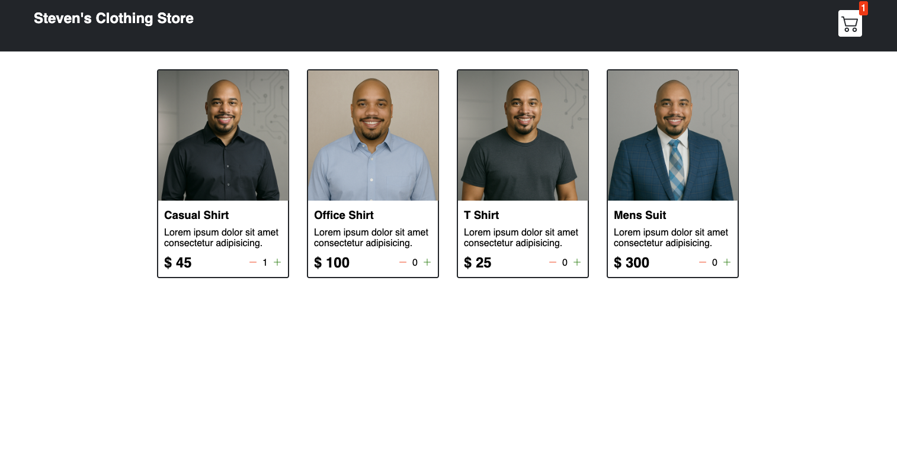

# shopping-cart-project

#  Shopping Cart Project

A simple and responsive shopping cart web application built with HTML, CSS, and JavaScript. This project dynamically renders a product catalog and allows users to add or remove items from their cart with persistent state via `localStorage`.

##  Features

-  Dynamic shop item rendering from data
-  Add or remove items with quantity adjustment
-  Cart state saved in `localStorage`
-  Price and quantity auto-calculation
-  Clean and responsive UI design

##  Project Structure

shopping-cart-project/ ├── index.html # Main HTML page ├── style.css # Styling for the app ├── script.js # JavaScript for dynamic behavior ├── images/ # Folder containing product images │ ├── casual shirt.png │ ├── office shirt.png │ ├── t-shirt.png │ └── Suit.png └── README.md # Project documentation

##  Screenshots
